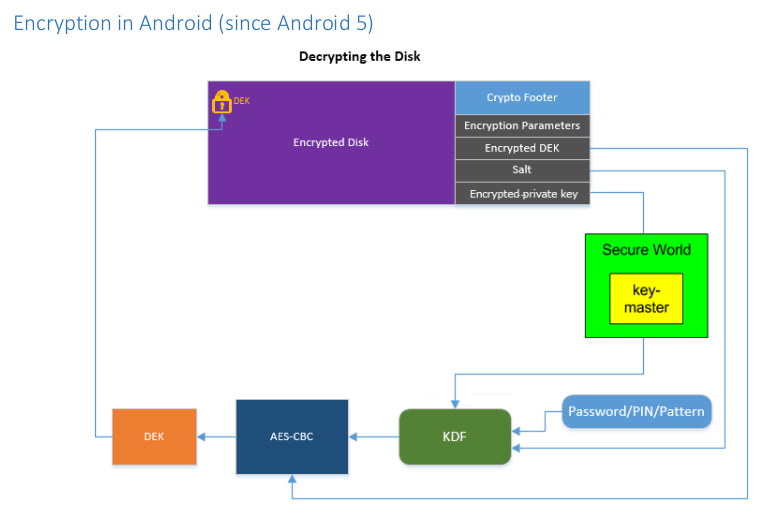
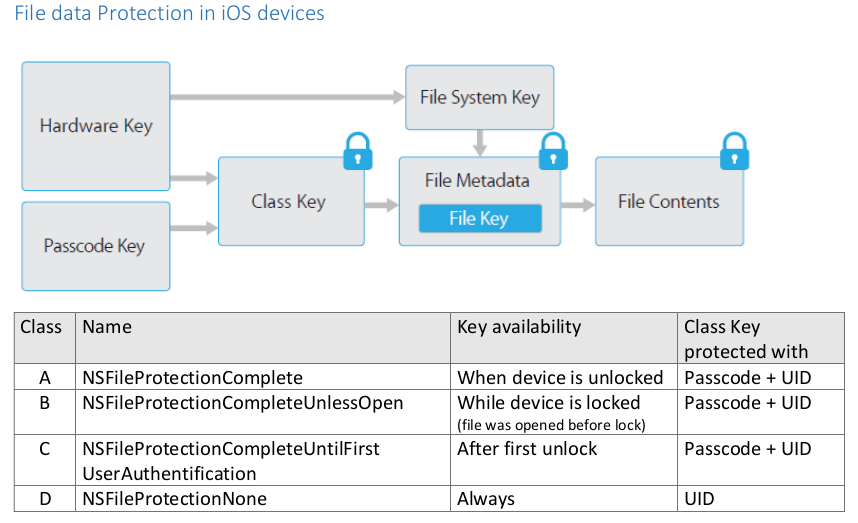
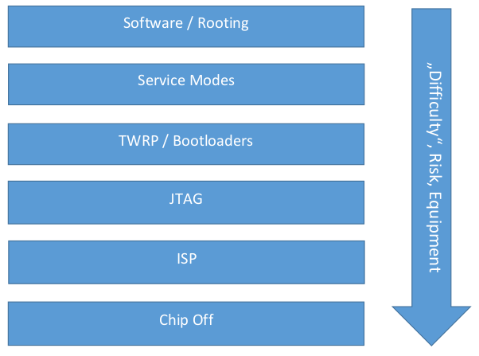

# Summary Digital Forensics WS 2022

## 01 Analysis Methods
**Digital Forensics**:
- A collection of tasks conducted by system administrators, network engineers and law enforcements.  

Usual setting:
- Expert within a company
- Technical expert witness (at court)
- Consulting output: Deliverable is a report (Gutachten)

### Gutachten
Split in two parts
- **Befund** (factual part): Contains all objective facts and how they where obtained. Includes dates, hash values, used software ...
- **Gutachten** (expert testimony): answers specific questions, includes expert interpretation  
Main goals: comprehensive, preserve data (integrity), describe ground truth (judges usually don't know technology)

### Definitions
- **Forensic science**: Application of science to the law 
The identification, collection, examination and analysis of data while **preserving the integrity** of the information and maintaining a strict **chain of custody** for the data.
- **Integrity**: Preventing accidental modifications of data at all cost, enforced using hardware write-blockers, verified using cryptographic hash functions (SHA-256 or better, MD5 & SHA-1 are broken, but can be still fine for digital forensics (fast and efficient))
- **Weak collision resistance**: Find any input for given hash value (sufficient for forensics)
- **Strong collision resistance**: Find two input which have the same hash value
### Chain of Custody
- Where, when and by whom was the evidence discovered and collected?
- Where, when and by whom was the evidence handled or examined?
- Who had custody of the evidence, during what period? How was it stored?
- When the evidence changed custody? When and how did the transfer occur?
 

In general: **Documentation is key**!

### Forensics within a company
- Find cause to reconstruct malicious events
- Build arguments and find evidence
- Possibly prosecution, to find perpetrator
- Lessons learned, to prevent further similar events
- Possibly relevant: Due-Diligence (Prüfung), compliance, decision support for further financial investments, securing intellectual property
- Support in daily business: Troubleshooting (e.g. Network forensics), data recovery, securing data (e.g. archiving old PC as image), incident reports
- Tradeoff between: Rollback and keeping incident internal (easy) vs. creating virtual crime scene, going public and pursue prosecution (costly)

### Basic principles / How to conduct analysis
- **Documentation is everything**
- Check and calculate hash values
- Document all used software (down to build number)
- Video for manual steps / script
- Do not modify anything **at all cost** (or at least as little as possible in a planned way)  

Computer turned off:
- Do not turn on
- Remove the hard drives
- Create images with hardware write-blocker (backup & working copy)
- Calculate hash values prior and after every step
- Always do byte level copies

Computer turned on:
- Document the status of the computer and every step your team does (e.g. lock, hibernate, running, screen saver)
- Don't start random clicking
- Secure RAM using DMA devices like Expresscard, Thunderbolt or Firewire (or with software) for RAM analysis
- Funky acquisition: cold boot attack, or PCILeech
- Do not trust the computer, the local tools or the operating system
- Pull the plug - do not shutdown. Continue with "computer off"

Smartphone or Tablet:
- Similar to PC, but RAM is harder to capture
- Logical vs. physical extraction
- Custom apps, remote rooting, remote access (e.g. Cloud) or custom bootloader
- Passcode, passphrase or device encryption makes things harder

Stages of analysis:
- Preliminary analysis, acquisition of facts and evidence
- Get access to data (e.g. RAID, encryption), analyses data
- Reporting, visualize the data, draw conclusions
- Accompanying documentation: hash values, chain of custody, evidence bags, pictures, videos

### Different analysis methods
#### Timeline analysis
- Goal: reconstruct timeline of events by analyzing every file
- Information sources: filesystem metadata (MAC timestamps), logfiles, network traffic
- Last file access: M = modified, A = accessed, C = created (different rules for Unix / Windows, viruses can change timestamps)

Timestamp paradoxon:
- MAC timestamps seemingly paradox in NTFS after copying/moving files
- M-time < C-time (can be used to identify source and destination)

#### Network analysis
- Infected systems can hide processes (rootkits)
- Can be monitored externally, no need to access or trust the operating system (wifi sniffing, arp spoofing, ...)
- Use wireshark or tcpdump for analysis (IP addresses, port numbers, content, ...)

#### Keyword analysis
- Find files with wordlists of interest
- Simplest, yet still surprisingly effective method

#### File reconstruction
- If a file is deleted, only metadata is (partially) destroyed
- Data region is marked free, but not overwritten
- File can in many cases be reconstructed, as long as it is not (partially) overwritten

File shredding:
- Secure deletion by overwriting it
- Tools like shred (*nix), WipeFile (Windows)
- Or: physical destruction

#### File Carving
- Looks for file signature on hard drives
- Many files have predefined header and footer
- Simple pattern matching, data as stream
- E.g. JPEG starts with 0xffd8 and ends with 0xffd9
- File fragment classification still hard problem

#### Whitelisting of files
- Files of no particular interest can be whitelisted
- To counter increased analysis time for 4+ TB harddrives
- National Software Reference Library (NSRL), by NIST (publishes hash values)

#### Sector hashing
- Hashing hard drive sectors, instead of files
- Benefit: Partially overwritten files or files in slack can be found
- Problem: Number of hash values

#### Fuzzy hashing
- Sometimes cryptographic hashes are insufficient (change in single bit yields to totally different hash)
- Problem: How to find similar files (on bytelevel)
- Solution: Split files intelligently, and apply some form of
function (but grows exponentially)

Tools: ssdeep, sdhash

#### Media analysis
- Analysis of user- and program data
- Many small and specially dedicated tools
- Browser history, EXIF data, PDF metadata, printer spooler

#### Regripper
- Windows registry is very powerful source of information
- E.g. UserAssistKey (contains all executed programs of user, number of executions and last execution)
- Windows 10: Windows 10 timeline (sqlite)

## 02 File-Systems
Examples: NTFS, FAT, XFAT, EXT4 (Linux), XFS (modern Linux)  

Data layer:
- Smallest addressable unit is 1 sector (4096 bytes, used to be 512 bytes, now emulated 512 bytes)

Clustering file systems:
- File system clusters multiple sectors for efficiency and less addressing overhead
- In NTFS in most cases 8 sectors in one cluster (4096 bytes size)

Metadata layer:
- Additional data about the data
- Map file names to actual data on the drive
- Permissions, timestamps, owner, ...
- Data fragmentation, optimizations and more (different for each file-system)

File name layer:
- Interface to organize drives, folder and files (usable for humans)
- Operating system, file system and controller work in background

Sleuth-Kit (File System Forensic Analysis): Open source tool for disk analysis (Autopsy as frontend)

Boot sector:
- In FAT & NTFS, first 512 byte in file system
- Contains start address, sector- and cluster sizes and link to FAT or MFT

Partition table:
- Master boot record in the first 512 bytes
- Describes partitions on disk (start&end CHS, start LBA, sector count, type of partition, flags)
- GUID partitioning: Part of UEFI standard, solves limitations of MBR

FAT = File Allocation Table
- Relatively simple, but robust
- Partition contains two copies of the FAT
- Each file and directory has an entry in the FAT (name, size, metadata, starting cluster)
- FAT32 has maximum file size of 4GB
- two identical FATs can be interesting e.g. for Truecrypt Hidden Volumes

NTFS = New Technology File System
- Default in Windows since forever
- Has access control and journal
- Still not openly specified (but open source driver available)
- Master File Table (MFT) as index structure stores everything
- Files, directories and metadata each have an entry (fixed size, usually 1K)
- Despite MFT, no predefined layout on drive

### Special areas on disks
HPA - Host Protected Area:
- Area on disc which is not easily accessible for file and operating system
- Mostly used for recovery and backup by certain tools
- Malware might use non-persistent HPA
- Detecting HPA: Compare available and physical sectors of hard drive (difference means HPA is set)

DCO – Device Configuration Overlay:
- Allows to limit storage capacity

Naive tools don’t detect DCO & HPA!

## 03 Legal and Organizational Aspects
#### Why do courts rely on expert witnesses?
- Often judges are lacking expert knowledge for certain fields necessary to reconstruct facts
- Expert witnesses („Sachverständiger“) as experts in their fields of work lend their expertise to the court

#### What is an expert witness („Sachverständiger“)?
- Person qualified and competent on a certain field of work to identify and work out (information about) facts, analyze and evaluate facts based on their professional knowledge and experience and present the result to court in form of an impartial report (Gutachten)
- Not a protected job title, but there is a official certificate („Allgemein beeideter und gerichtlich zertifizierter Sachverständiger“). They can be found on an official list

Also there are „Amtssachverständige“ (official expert witness), which are employed by authorities and Privatgutachter (private expert witnesses) creating reports for private clients.

#### Requirements to become a sworn and court-certified expert witness
- Knowledge oft the most important aspects of procedural law, expert witness law and how to write a proper report
- At least 10 years of professional experience or 5 years of professional experience + a university degree (or similar) for the field of work
- Personal suitability and reliability

Candidates are tested in an oral exam by a judge and two expert witnesses.  
Recertification mandatory every 5 years (providing proof of ongoing education/training)

#### Professional Standards set by the Hauptverband for it's members:
- General standards: Objectivity, impartiality, reproach-free behavior, incorruptibility, secrecy, mandatory further education, restrictions on advertisement, collegial behavior towards other expert witnesses
- Standards for presentation of findings and reports: meeting set deadlines, issuing warnings if costs for a investigation surpass a certain amount, checking your own competence and impartiality before accepting a job, standards for inspections and assessment, guidelines for contents of reports

Even if you are no member of the Hauptverband, those standards apply to all expert witnesses working at Austrian courts.

#### Different types of evidence in court:
- Documents
- Witnesses
- Expert witnesses
- Inspections
- Hearings/Interrogations

#### Principle of „freie Beweiswürdigung“ (independent acknowledgement of evidence):
- Judges may decide freely and independently which pieces of evidence to acknowledge and how to weigh different pieces of evidence against each other
- Even hearsay or evidence obtained illegals can be permitted

#### Expert witnesses as evidence
- Expert witnesses draw conclusions but may never judge or draw any legal conclusions
- An expert witness report ordered by the court can never be disproved by witnesses but only by another expert witness report ordered by the court

### Expert witnesses <> witnesses <> experts as witnesses
#### Expert witnesses
- Are appointed by the court
- Note facts based on professional knowledge
- Draw conclusions based on those facts
- Convey professional experience
- Don't make any perceptions by chance
- Can be replaced
- Get payed

#### Witnesses
- Report perceptions they made by chance
- Are not to assess those perceptions or draw any conclusions based upon those
- Cannot be replaced
- Do not get payed (expenses only)

#### Experts as witnesses
- Professional knowledge like expert witnesses
- Made perceptions by chance
- Are not appointed by the court
- May not draw any conclusions but only report their perceptions (threated like normal witnesses)
- Do not get payed (expenses only)

#### Appointing expert witnesses
- In civil action: Appointed by the judge
- In criminal action: Appointed by the prosecutor for investigation procedures, appointed by the judge for main hearing/trial (usually the same person)
- Generally fees are payed by purchaser/customer, but costs can be layed upon the losing party of a trial (in the court)

### Reports and argumentation
- A Gutachten (expert witness report) is a fact-based reconstruction of an expert about a certain question/problem
- Purpose is forensic reporting and enabling the judge to establish the truth
- No legal obligations or restrictions in the private sector, but professional standards apply and liability for wrongful reporting
- Generally all relevant facts included in a report have to be proven (Apart from obvious or publicly well know facts)
- In civil trial both parties can agree upon certain facts (so those do not have to be proven)
- Principle of material truth applies: All circumstances of a fact have to be taken into accord (positive and negative)
- Forensic analyst / expert witness only present facts, but no legal facts (legal facts are decided by the court only)

#### Expert witness report
- Usually contains Befund und Gutachten
- But: There are no detailed legal obligations for the structure of a report (structured report helps to prevent mistakes)

What should be contained in the findings of a digital forensics report? 
- System description of the analyzed computer/network/etc (if applicable)
- Forensic tools used in the investigation
- Hash values of forensic images, analyzed files or archives and of evidence files found
- Description of acquisition of forensic imaging of devices (place, date/time of acquisition and imaging, tools used for imaging, hash values of resulting images)
- Description of undertaken actions in investigation (including code scripts or queries)
- Metadata of evidence files you found
- If needed: screenshots of evidence files, if there is no better way to include contents in your report (attach copies of the original files)

Requirements for the Assessment in an expert witness report:
- Sufficient treatment of the topic / assignment and sufficient answers to questions
- Definite conclusions based on evidence
- Those conclusions need a comprehensive reasoning; they must be logical, comprehensible and free of contradictions
- An interested layman should be able to comprehend your reasoning

Inadmissable points in the Assessment in an expert witness report:
- Incomplete recordings of facts
- Conclusions regarding legality of legal facts
- Statements that cannot be verified
- Overstepping of your expert knowledge
- Insufficient considerations of opposing viewpoints (e.g. in form of an opposing expert witness reports of another party)
- Unfounded prognosis

### Warranty and liability
- Expert witnesses are liable for wrongful work or reports
- Liability according to strict standards
- A report is wrongful if it violates any laws or legal norms or a contract signed with a customer
- For expert witnesses for legal proceedings: private liability for wrongful reports despite official appointment
- But expert witnesses appointed by courts cannot be sued for defamation

An expert witness report is deemed correct if it:
- was created carefully and thoroughly
- is „lege artis“ (sufficient to standards of the science/art/profession)
- can be understood by laypersons
- can be validated by experts  

Even if it comes to wrong conclusions.  
In contrast an expert witness report is deemed wrongful if it does not reflect the conviction of the expert witness, even if it comes to the correct conclusions.

#### GDPR (Datenschutz-Grundverordnung)
GDPR has to be obeyed by authorities too, but no obstruction of legal proceedings by use of GDPR-requests wanted (courts can deny GDPR-requests concerning legal proceedings).  
Expert witnesses hired for private investigations: GDPR applies in full

### Suggestion for a forensic procedure
- Verifikation des Zwischenfalls (incident verification)
- Systembeschreibung (system description)
- Rollenbeschreibung, Team zusammenstellen (role description, team assembly)
- Datensicherstellung (data imaging)
- Datensicherstellung (forensic imaging)
- Getting access to information depending on imaged data
- Forensic analysis & collecting evidence (depending on question/task)
- Reporting

## 04 Smartphone Forensics
### Challenges of Smartphone Forensics
- Data difficult to obtain (no dedicated interface to read data, restrictions by OS, encryption and advanced security features)
- Often no physical extraction possible
- Limitations of “forensic soundness” have to be accepted
- Frequent hardware updates (new device generation every year)
- Frequent software updates (new major version every year)
- Countless models on the market, many with OS-modifications by the manufacturer
- Large number of 3rd party apps by various manufacturers installed on most devices (with frequent updates)
- User locks on most devices
- Volatility of data

Professional forensic experts deal with smartphone forensics by using (commercial) toolkit (artifact based data analysis).  
Limitations of commercial toolkits:
- To many phone models out there to support them all
- To many apps out there to support them all (Each new app version must be reverse engineered and support added)

### Acquisition
After acquiring a mobile device, it should be disconnected from the cellular network as fast as possible. Otherwise: 
- the owner or a third person could wipe or lock the device by a remote command
- incoming calls, texts or other data might overwrite data that has been deleted but would still be recoverable

A device can be disconnected from the cellular network the following ways:
- Activate airplane mode (easy, reliable, but device sometimes needs to be unlocked and GPS and WiFi may stay active)
- Use a faraday-bag or a similar container (device does not need to be powered down, may not be 100% secure (seal properly), shortens battery life (connect power pack))
- Remove SIM-Card (Wifi may stay active, not possible for eSIM)
- Power off device (Can change or overwrite data, may activate password locks, may lock encrypted phone, sometimes needs to be unlocked, alarm clock may power on again) 

If a device is found connected to a PC, it is recommended to dump the memory of the PC before disconnecting the mobile device. The PC should later be searched for synchronized data.

### Documentation
- IMEI (International Mobile Equipment ID) is usually used as a cellphone’s ID for documentation purposes (15 decimal digits on back of phone or SIM-card tray)
- ESN (Electronic Serial Number) number was used in the US / CDMA network (Phased out in favor of the MEID)
- MEID (Mobile Equipment Identifier) number is now used in the US / CDMA network (also 15 decimal digits)

### Data sources
On device:
- **RAM** (Not really a thing in professional smartphone forensics)
- **ROM** (Only contains code to initialize the boot process)
- **Flash Memory** (OS and user data are saved on the internal flash memory)
- **SIM card** (A SIM consists of a small microprocessor and memory and stores (among other) the following information: ICCID, IMSI, SMS messages and contacts, small programs like info-services)
- **Embedded SIM** - eSIM (programmable SIM that is embedded directly into a device, can be provisioned remotely, possible to swap profiles without removing SIM, multiple phone numbers on one device, probably no forensic relevant data without service provider support)
- **SqLite databases** (most data is saved in sqlite databases)
- **External SD-card**

Outside:
- Computers used to sync devices
- Backups
- Additional data from the carrier (call logs, etc)
- Outside servers (Cloud-Forensics)

### Android vs iOS
#### File-Systems
- Android: YAFFS (since 2.3), Ext4 for newer versions, sometimes ext3 or F2FS
- iOS: HFS+ (Hierarchical File System+) previous to 10.3 and APFS (Apple File System) for newer versions

#### Partitions
- Android: /boot, /system (OS + UI, readonly), /vendor, /recovery, /data, /cache, /misc, /sdcard, /sd-ext, /sdcard1, /sdcard/sd
- iOS Devices have one disk (disk0) and slices (partitions): iOS System Partition (disk0s1, readonly), iOS Data Partition (disk0s2, writeable)

#### Android Updates
- Google releases new Android version, manufacturer adapts it to their needs
- "Google's Pixel phones get updates immediately, third-party flagships get updates in six months to a year, and everyone else gets updates when they throw out their existing handsets and buy new ones"
- Devices only get updated if manufacturer sees model as viable target
- Update rollout takes a long time (many phones with vulnerabilities left, even if patch available, some smaller (security) patches might be skipped because of adaption costs)
- Sometimes drivers might not be available for newer Android versions
- Since Android 6.0: Security patch levels (monthly security patches)
- Since Android 8.0: "Project Treble" (Interface between OS & hardware, easy, fast and cheap to release android updates)
- Since Android 9.0: Play Protect App notifies a “risk” if the device has not been updated for more than two months
- Legal obligations for manufacturers of Google Android devices (OEMs obliged to ship updates for two years, by the end of each month device must be protected against all vulnerabilities identified more then 90 days ago)
- Android 10: Project Mainline (Updating Android system modules through Google Play, allows updating single system component without full system update)

#### iOS Updates
- OTA update distribution by Apple directly to devices
- Good support for older devices
- Since iOS 15: Standalone security patches
- OS-images can also be downloaded and flashed on phones via iTunes (no downgrading except from beta, needs to be signed, only latest version signed)

### Smartphone Security
#### Sandboxing
- Every app has its own isolated environment
- Apps unable to access other's environment (passwords etc.)
- Apps unable to access the systems environment (storing sensitive user information)
- Sandboxing implements the basic user security model by Linux (every app runs as its own Unix user, apps folder only accessible for its own user)
- Inter-App communication and access to system functions is API based (e.g. camera, location, ...)
- Android: Additional security in the Linux kernel due to SELinux
- iOS: Advanced OS features such as iCloud through entitlements (Need certificate which can be revoked by Apple)

#### Third party apps
- Android: Main source is Google Play Store (sideloading possible through browser or custom AppStores)
- Google reviews all apps before publishing and during installation, checks against SafetyNet
- Signature checks through Google Play Protect
- iOS: Only source is the Apple App Store (no sideloading)
- All submitted apps are reviewed manually and automatically
- Still scams and infected apps (code reuse as a way to bypass signature checks and heuristics)

#### Android Encryption
- Since Android 3: Optional Encryption (Crack with Password Toolkit or Hashcat)
- Since Android 5: Hardware-backed storage of the encryption key added using Trusted Execution Environment’s (TEE) signing capability (prevents offline attacks)
- Since Android 6: Encryption mandatory for all devices which are shipped with Android 6 or newer and provide sufficient read/write speed for encrypted content
- Since Android 6: Secure startup optional (PIN/Pattern before boot)
- If secure startup is used, the whole disk will be encrypted with the users PIN/Pattern/Password and a built-in hardware key
- Since Android 7: file-based encryption introduced. This allows different files to be encrypted with different keys that can be unlocked independently (boot directly into lock screen, separate accounts)

#### iOS Encryption
- AES 256 crypto engine between flash storage and memory
- Two important keys stored in hardware: UID (device ID, used for binding data to one device) and GID (device group ID, used for non-security tasks like device recovery)
- No access to UID or GID through debugging interfaces such as JTAG
- UID or GID can’t be read by software or firmware
- Secure Enclave (SEP): Security co-processor / dedicated ARM v7a processor
- Four different classes of protection for files (some files only available after unlock, some before)
- Hierarchy of keys (file is encrypted with a file-specific key, which is encrypted with one (or more) of the four class keys)
- Encrypted file-specific key is stored in the file’s metadata
- Decryption of a file is dependent on the availability of a decrypted representation of the corresponding class key

- iOS Data Protection: Very fast and reliable data reset, effaceable storage, deleted keys cannot be recovered

### Biometrics
- Touch ID takes only a photo of the finger and is therefore much easier to trick than traditional fingerprint scanners with wax dummies or even photos of fingerprints
- Apple: Chance for a false positive with Touch ID: 1:50.000
- Apple: Chance for a false positive with Face ID: 1:1.000.000
- Android and iOS (recent versions): unlocking a phone with biometrics only will not enable you to perform a data extraction (Passcode needed)

### Data Extraction
- Android Debug Bridge
- Android Backups (often inadequate because of encryption)
- Flash Android to access files
- iOS iTunes Backups (does not contain all data we want, e.g. emails, locations etc)
- iOS Keychain (System-wide storage for passwords, encryption keys, authentication tokens and credit card data)
- Set a up a backup password before creating an iTunes backup for forensic examinations in order to extract the Keychain data
- Also look at media files, shared files and crash logs

Alternative Extraction Methods for Android:

Alternative Extraction Methods for iOs: 
- Jailbreaking (Uses exploits to unlock the user root)
- checkra1n (Hardware exploit)
- Bruteforce (Legacy)
- GrayKey by Grayshift (2018, bruteforce on device)
- Unlock Labs: Cellebrite Premium/CAS Labs ... (time consuming and expensive)
- Some open source tools available

## 05 Operating Systems & Tools (Open Source)
### Windows
- Artifacts backwards compatible
- Windows 11 and Windows 10 are very similar
- Windows 7: No more updates, but still used (just like Server 2012)
- Windows Registry: Central point for configuration, browsable to regedit, dynamically created by hive-files
- Most important hive files: C:\Windows\System32\config and ntuser.dat (HKEY LOCAL USER)

#### SAM = Security Account Manager
- Stores user and their SID (security identifier), encrypted but key is in systems hive, contains local user password (different for Windows Hello / Microsoft online account), stores account created, last login and login count
- SIDs used for permission & access control, available for users, groups, machines, services ... (randomly created)

#### System hive:
Information on connected devices (USB, printer, network adapters)

#### Software hive:
Wifi information (SSID, MAC, last connected), obtain geolocation

#### User profiles:
Default User and other users with own NTUSER.dat

#### NTUSER.dat
- Programs stared, how often
- Connected USB devices
- MRU (most recently used) for applications
- Search queries for files (explorer)
- UserAssistKey: Execution of applications

#### Windows Registry
- Each entry has modified timestamp
- Each hive has a transactional log
- Mixture of clear text and binary (use tool like RegRipper to analyze)
- Possible ot recover deleted entries (registry entry is only marked as deleted)

#### Recycle bin
- No change in physical data layout
- Only logical path is changed
- Not plaintext but can be reversed

#### Important directories
- C:\Windows: OS files
- C:\Windows\System32: executables and libraries
- C:\Windows\System32\config: registry files, Windows user DB (SAM), event log files
- C:\Windows\System32\drivers\etc: hosts for name resolution
- C:\Windows\Prefetch: Often executed executables are stored here (increase system performance)

#### Timeline
- Windows 10 Timeline: in sqlite

#### Logging
- C:\Windows\System32\config.evt
- Not plaintext, but can be read by tools

#### Services (Demons)
- services.msc
- Commanly used by malware to run as a service

#### Thumbcache
- Miniature preview of images
- Could still have representation of securely deleted files

#### Volume Shadow Copy
- "Systemwiederherstellung"
- Can restore files and directories
- By default on for system partition

Many more artifacts on Windows (e.g. Timezone, cookies, WiFi event log ...). Depends on the context.

### Linux
Everthing is a file!

#### Important files
- journalctl in systemd (log files)
- /etc/ (config files)
- /home -> .ssh/known_hosts, private folder (for each user)
- Installed programs by command
- $PATH
- Autostart

#### Hiding data:
Everything with a dot is hidden by file system. ('...' is complicated)

#### Running processes:
/proc/, netstat, dump RAM

#### Boot:
/boot contains kernel and bootloader (unencrypted)

#### Problems for acquisition
- Open source
- Easy to add dead man switch
- Easy to modify boot sequence, applications
- Encryption

#### File system
- Can read different file system
- Build encrypted software RAID
- Encrypted ext4

#### Volumens:
LVM (Logical Volume Manager): relocation of volumes, maps physical devices to logical volumes (e.g. multiple physical volumes to one logical volume) 

#### Rootkits
- Defend against (game over if you have one)
- Traditional rootkits replace binaries (e.g. ssh demon)
- Easily detectable using tripwire or hashes (suspicious timestamps)
- Kernel rootkits replace system calls (hash value stays the same, no change detected by user, system completely comporomised)
- Virtual rootkits turning running system into a VM (even more difficult to detect)

#### Tools
- dd: Physical copy of data
- file: detects file types based on headers / start of file
- strings: ASCII string from files and binaries
- gdb, ltrace, strace, hexedit, script

#### File Carving
- Finds files based on content or header/footers
- Deleted files and files in slack space can be found by this
- not possible with compression, defragmentation & encodings

### Tooling
- Sleuth Kit / Autopsy: De-facto open-source tools for hard drives, Autopsy as frontend (import hashfiles for whitelisting compatible)
- TSURUGI Linux: Linux Distro for Forensics (a lot of tools included)
- Kali: Also plenty of software to forensics (forensic bootmode included, better to use hardware writeblocker)
- SIFT Workstation: Customized Ubuntu with lot of useful tools
- xplico (Legacy): Was good for analyzing network
- Wireshark for Network traffic
- bulk_extractor: highly parallelized, very powerful, similar to file carving: looking for files and decompressing everthing
- Know your tools!

## 06 Counter-Forensics
Techniques used as countermeasures to forensic analysis (ensure privacy or for criminal reasons).

### Securing the perimeter
- Prevent physical access (Keylogger, Rubber Ducky, Stealing hard drive)
- Smartphone: Biometrics, more then 6 digits, no pattern drawing, do not display notification in lock screen

### Data Locking (Encryption)
- PCs: TrueCrypt/VeraCrypt
- Offers full disk encryption, partition encryption or containers
- Encrypted containers hidden inside of another encrypted container are not easy to detect (but files inside hidden volume leave traces)
- Attacks on TrueCrypt: Bootkit that modifies MBR to observe password entry, cold boot attacks, obtaining RAM via Fire-wire
- Other options for encrpytion: dm-crypt/LUKS (Linux), Bitlocker (Microsoft), FileVault (Apple), OPAL (Hardware)
- Smartphone encryption is most important counter forensic measure
- End to end encrpytion for Messages (e.g. Signal protocol). But: Metadata, messages saved on device and cloud-backups
- Cellphone providers will hand logs to authorities
- Do not use SMS-messages (easyily redirected)
- Call encrypted since 2G (but easily decrypted), frequency jammers force fallback to 2G, IMSI catchers (fake cellular tower)
- Use Crypto Messengers for calls too

#### Cold boot attack
- Side channel attack on RAM after computer is turned off
- Memory dump of RAM created
- Can be used for gaining encrypted keys of the OS

### Data Hiding
- Phones: Apps with fake funcitonality (easy to spot after data extraction)
- Dual boot
- Steganography (hide information in another file, attempt to hide data by leaving it in plain sight), useful in media with plenty of noise (pictures, videos, audio files)
- Methods of steganography: Concealing messages within the lowest bits of noisy images or sound files, swapping pixel positions, modifing the echo of a sound file, concealing data in ignored sections of a file
- Hiding data as fragements in slack space (unused space in a file allocation block or memory page), can be done by faking bad clusters

#### Polyglots
- File interpretation: Depending on the interpreter a file can be both a java program, pdf, etc (files identified by early filetype identifiers)
- Encryption: A encrypted file results in another valid file
- Concatenation: Files are simply concatenated
- Parasites: File contains foreign data, but is still tolerated by system (cow swallows microSD card)

### Artifact preventing
#### Tor (The Onion Router)
- Data encrypted in multiple layers (one per relay on the path, 3 hops to target)
- Hides IP-addresses
- Tor has no central point of trust (unlike VPN)
- Robust, very well established, but slow
- First relay has access to IP, last relay (exit node) might see communication content (malicious tor exit relays possible)
- Certain agencies are said to be able to identify Tor users after a few months of observation
- Tor hidden services allow anonymous servers & services (no geolocation based on IP), only reachable within the Tor network

#### Smartphone
- Prevent your phone from collecting metadata that could be used as evidence (app permissions, turn off GPS/Bluetooth/NFC, turn off logs, do not connect to wifi)
- Even secure messengers leave traces in database
- Anonymity apps like Orbot, Orfox, Tor, OpenVPN and Signal will always leave traces on mobile device

#### Artifact wiping
- Disk cleaning utilities (overwrites data, may leave trace of usage)
- File wiping utilities (delete individual files, mal leave meta data and traces)
- Disk degaussing/destruction (magnetic field applied to device, costly but effective)
- Physical destruction (e.g. Shredding)

### Trail Obfuscation
Confuse, disorient, and divert the forensic examination process.
- Change timestamp to random (Timestomp tool)
- Spoofing false information (Decoy data, modify Android OS)
- “Direct Attack” on forensic toolkit flaws and processes
- Cracking the forensics expert network
- Social engineering
- Sensor for self destruction

### Security through obscurity
Reliance on the secrecy of the design or implementation as the main method of providing security.
- Use Windows Phones, small knowledge about analyzing, but is a matter of resources
- Never use obscurity as the only security mechanism

### Specialized hardened phones
Smartphones were never designed with security or privacy in mind
#### Encrochat
- Hardened android device as a service
- Encrypted device, secure communication apps between EncroChat (can not communicate with non-EncroChat devices, panic button for wipe)
- Hacked by authorities and shut down
- Operation Trojan Shield: Users switched from EncroChat to AN0M, which was actually operated by the FBI and contained backdoors

### Anti-Forensics & Privacy on the move
- Randomized MAC-Address prevents tracking via WiFi catcher
- Faraday bag, on/off on demand
- Lockdown modes (turning of special functionality of phone to be more secure)
- Anonymous SIM-cards
- Burner phones
#### Border/Checkpoint controls
- Leave certain devices at home, use temporary devices, delete content
- Use file-based encryption, power off device shortly before arrving at border
- Agents may ask travelers to unlock their devices, provide their device passwords, or disclose their social media information (no win dilemma)
- Stay calm and respectful, don’t lie to border agents or physically obstruct them
- Plan for no-win dilemma: Device could be seized -> Backups, How much data is needed -> Cloud data? -> Decoy data
 
"You shouldn’t do bad things. But if you do – don’t do it with a smartphone!"

## 07 Cloud Forensics

### Challenges, threats and advantages
- There might be data in the cloud, that can’t be found on physical devices
- Often, cloud account login information is stored on seized devices
- But: No physical access to cloud-data (unclear where it is stored, not possible to image whole cloud-server)
- No transparency (chain of custody?)
- No best practice methods (Forensic software for several SaaS-products available by now)
- Legal constraints

### Public clouds vs private clouds
Private clouds:
- Acquisition: generally possible, data center located in-house
- Analysis: trustworthy access-logs, VM images, router logs are mostly accessible
- But: less common, no scalability etc

Public clouds:
- Acquisition: difficult, no best-practice methods, distributed data, no physical acces
- Analysis: no access to access-logs, images, etc.

### Forensics in cloud
#### IaaS (Infrastructure as a Service)
- VMs may be controlled 
- Installation and configuration of forensic tools is generelly possible
- Still no evidence of physical location
- Solution: Snapshots, VM specific logs

How to access cloud data for investigations:
- Request data from provider
- Use credentials to log into account (2FA?, use cloud forensics software to copy data, API sometimes offers more data)
- Use access tokens found on device (no need for 2FA, limited lifespan)
- Issues with 2FA: Device is perhaps seized, but should not be online or connected to a network (Solutions: generate codes offline, search for recovery key sheet, crazy firewall network, SIM in other phone)

#### PaaS (Platform as a Service)
- Control over source-code
- Provider logs
- Impossible to control underlying system
- Problem: Runtime environment may change logs
- Solution: Don't trust the underlying system (deploy own logging)

### Google takeout
- Create an archive with all data from Google products
- Archives may take a long time
- It's not complete, they know more

### Legal aspects of cloud forensics
- Austria: Cloud extraction legal if done during house search, cloud extraction after house search requires search warrrant
- Germany: House search officially ends a few days later after a cloud extraction has been conducted in the lab
- Sweden: No cloud extractions permitted
- Internationally: Cloud extractions may violate international
laws. International data requests would be required. (But unclear in which country data is saved (multiple countries), service provider will not notice extraction and will not care)
- "Just do it, no one really cares. Wait and see if someone sues, then we will see what will happen."

### Difficulties with Cloud Forensics
- Google Drive Logs contain no hash values but Item IDs / File IDs (no correlation between File ID and file content, no way to tell what the file contents where in the past)
- You can only download the file, which is saved in the cloud for a certain File ID at the time of your investigation, calculate the hash value for the file you downloaded and document everything
- Google Docs, Google Sheets, etc cannot be directly downloaded (only export to word/pdf/excel)
- No good way to save/export version history of documents